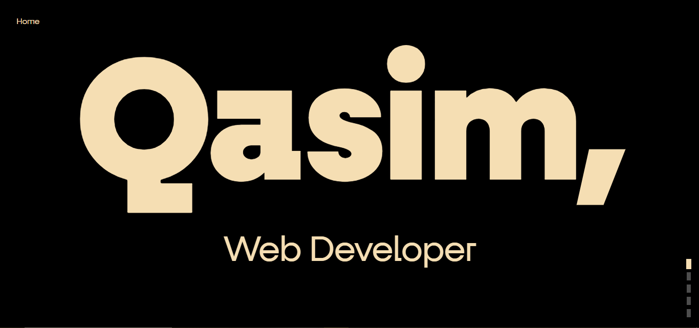
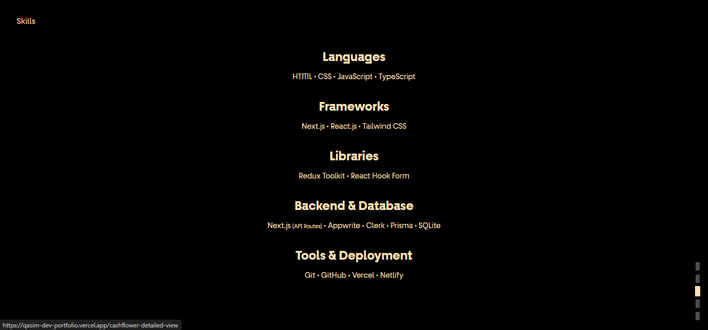
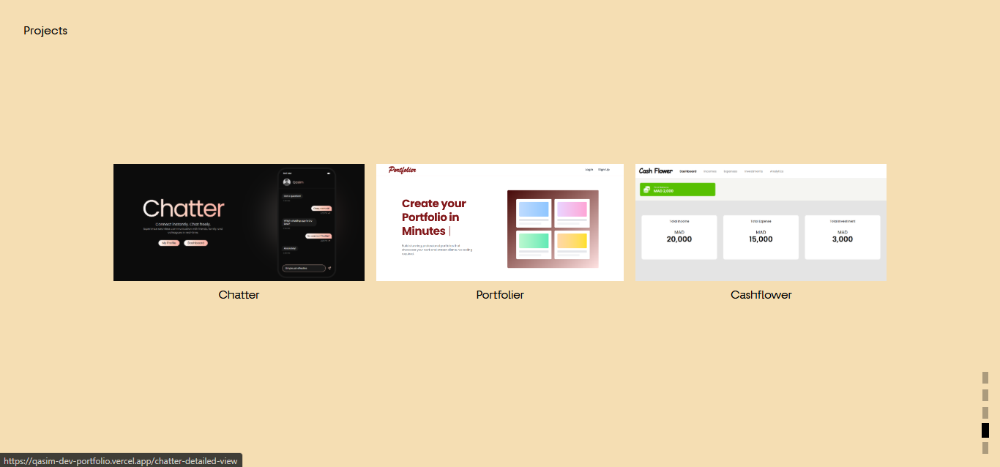
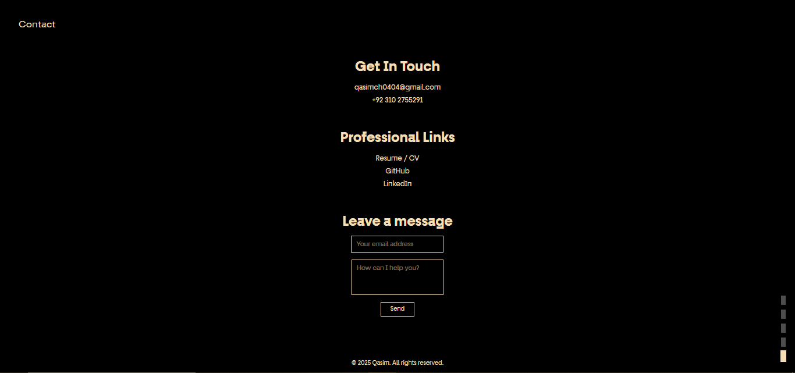

# My Personal Portfolio

A modern, full-screen scrolling portfolio showcasing frontend development skills with smooth animations and responsive design.

---

## Live Demo

[Portfolio Website](https://qasim-dev-portfolio.vercel.app/)

---

## Screenshots

### Home  
  

### About Me 
  

### Skills 
  

### Projects Section & Details Page 

  

### Contact 

---

##  Overview

This personal portfolio is a single-page application built with React and TypeScript, featuring a unique full-screen scrolling experience. The portfolio presents different sections (Home, About, Skills, Projects, Contact) as individual screens that users can navigate through using mouse wheel, touch gestures, or keyboard controls. The design emphasizes clean typography, smooth transitions, and a distinctive dual-color scheme (black/beige) that creates visual hierarchy and maintains user engagement throughout the browsing experience.

---

##  Key Features

- **Full-Screen Section Navigation**: Smooth vertical scrolling between different portfolio sections
- **Responsive Design**: Optimized layouts for desktop, tablet, and mobile devices
- **Project Detail Pages**: Dedicated pages with comprehensive project breakdowns
- **Contact Integration**: Functional contact form with Web3Forms API integration
- **Loading States**: Elegant loading spinners with bounce animations
- **Error Handling**: Comprehensive error boundaries and 404 page handling
- **Performance Optimized**: Lazy loading for project detail components
- **Visual Indicators**: Navigation dots showing current section with dynamic styling
- **Type Safety**: Full TypeScript implementation ensuring robust code quality

---

##  Tech Stack

### Frontend
- **React 18** - Modern React with hooks and functional components
- **TypeScript** - Type-safe JavaScript for better development experience
- **React Router DOM** - Client-side routing for project detail pages
- **Tailwind CSS** - Utility-first CSS framework for styling

### Form Handling
- **Web3Forms API** - Contact form submission service

### Architecture Patterns
- **Context API** - Global state management for section navigation
- **Error Boundaries** - Graceful error handling
- **Lazy Loading** - Code splitting for performance optimization
- **Component Composition** - Modular and reusable component structure
- **Type Definitions** - Custom TypeScript interfaces and types

---

##  Development Journey & TypeScript Experience

### The Vision
I wanted to create something that stood out from typical portfolio websites. Instead of traditional scrolling, I implemented a full-screen section-based navigation system that feels more like a presentation or interactive slideshow. This approach allows each section to have its own visual identity and ensures visitors focus on one piece of content at a time.

### From JavaScript to TypeScript
This portfolio has a special significance in my development journey as it represents my first complete project built with TypeScript. Initially, I created the entire portfolio using JavaScript and React, which worked perfectly fine. However, driven by curiosity and the desire to improve my development skills, I decided to rewrite the entire project using TypeScript.

### Why I Made the Switch
The transition from JavaScript to TypeScript was motivated by several factors:
- **Better Development Experience**: IntelliSense and auto-completion made coding more efficient
- **Error Prevention**: Catching potential bugs at compile time rather than runtime
- **Code Documentation**: Types serve as inline documentation for future reference
- **Professional Growth**: TypeScript is increasingly becoming the industry standard

### The TypeScript Learning Experience
Working with TypeScript on this project was genuinely enjoyable and educational:
- **Type Definitions**: Created custom interfaces for project data, navigation state, and component props
- **Generic Components**: Learned to build reusable components with proper type constraints
- **API Integration**: Implemented typed responses for the contact form API
- **Event Handling**: Properly typed DOM events for navigation interactions
- **State Management**: Added type safety to React Context API implementation

### Key TypeScript Features Implemented
- Custom interfaces for project and navigation data
- Typed React components with proper prop definitions
- Type guards for runtime type checking
- Generic utility types for flexible component design

This project proved to be an excellent introduction to TypeScript, and I can confidently say that the improved developer experience and code quality made the learning curve completely worthwhile.

---

##  Future Enhancements

- **Dark/Light Theme Toggle** - Allow users to switch between themes
- **Animation Library Integration** - Add Framer Motion for advanced animations
- **Blog Section** - Integrate a blog for sharing development insights
- **Custom Cursor Effects** - Interactive cursor animations
- **Project Filtering** - Filter projects by technology or category
- **Advanced TypeScript Patterns** - Implement more sophisticated TypeScript features

---

##  Contact

**Qasim**
- Email: qasimch0404@gmail.com
- Phone: +92 310 2755291
- LinkedIn: [Muhammad Qasim](https://www.linkedin.com/in/muhammad-qasim-2874b5377/)

---

##  License

This project is open source and available under the [MIT License](LICENSE).

---